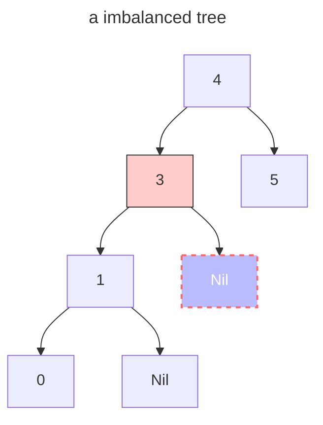
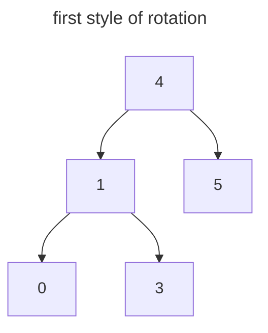
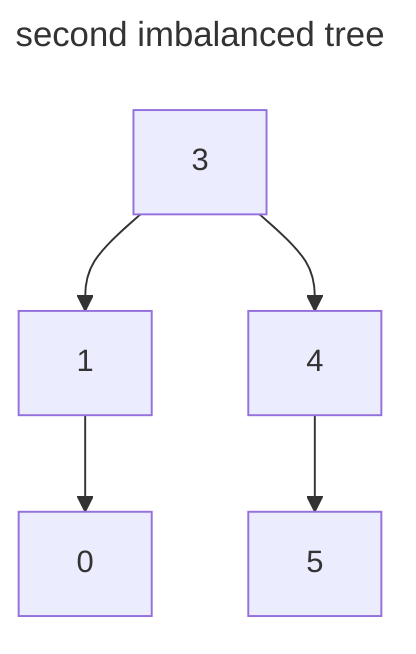
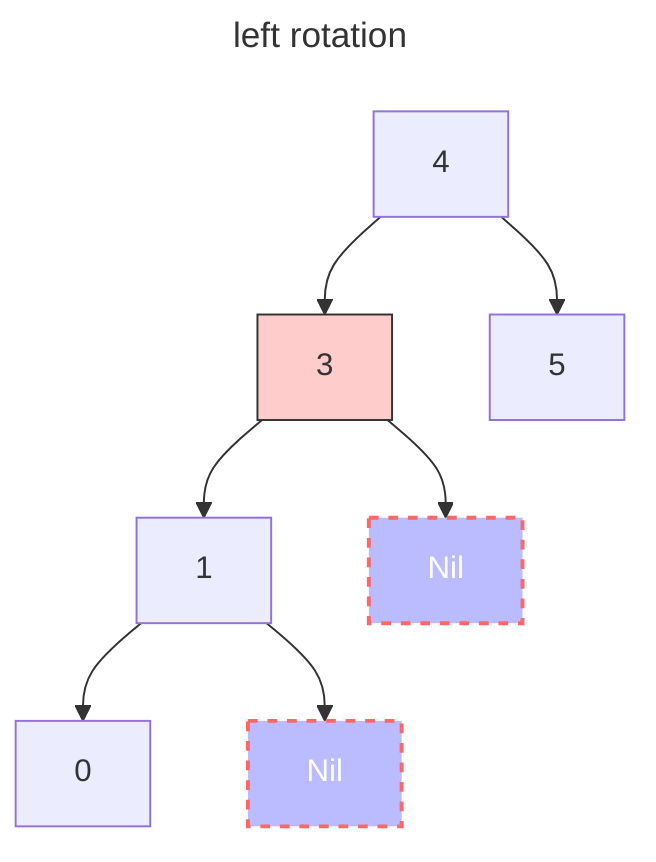
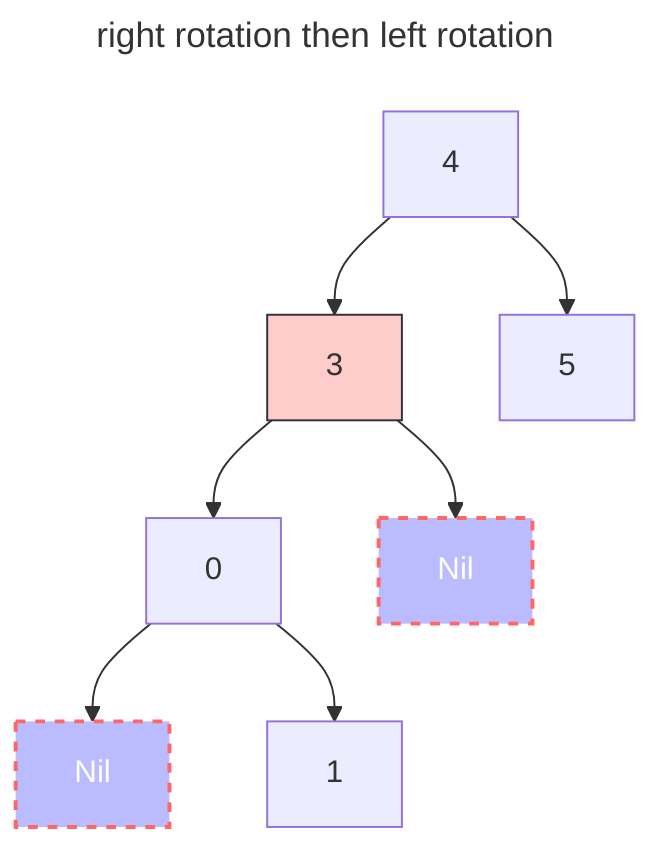

# tiny-rust
some tiny project used to practice rust skills

## smart_pointer

**Smart pointers** are Rust smart pointers implemented based on reference counting, which include the following features:

- Generics;
- Allowing for circular references in pointers;
- Overload the operators corresponding to smart pointers;

### How?

1. We need a reference counter that allows us to record how many times a variable has been referenced, we can call this counter by `ReferenceCounter`.
2. We also need struct that contains `ReferenceCounter` and `Target`, where Targe is a generics type used to hold the target object.
3. Overloading operator to ensure that the ReferenceCounter has the correct number of reference counts:
   1. reference
   2. dereference
   3. copy
   4. move
   5. drop

## AVL

### left rotation

### the rotation of each different situations

> The other situation is just converse to below situation.

### how to choose strategy

| factor of imbalanced node | factor of imbalanced node's child node | strategy                          |
| ------------------------- | -------------------------------------- | --------------------------------- |
| > 1                       | > 0                                    | right rotation                    |
| > 1                       | < 0                                    | left rotation then right rotation |
| < 1                       | > 0                                    | right rotation then left rotation |
| < 1                       | < 0                                    | left rotation                     |

